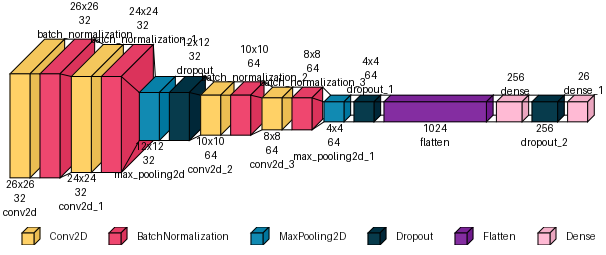

# keras-alphabet-classifier

## Description

This project implements a Convolutional Neural Network (CNN) for recognizing handwritten English alphabets (A-Z) using the Kaggle A-Z Handwritten Data dataset.

## Features
- Data preprocessing and normalization of 28x28 grayscale images.
- CNN architecture with convolutional, batch normalization, max pooling, dropout, and dense layers.
- Training with categorical cross-entropy loss and Adam optimizer.
- Model evaluation with accuracy metrics and visualization of training progress.
- Model saving and loading for inference.

## Usage
1. Place `A_Z Handwritten Data.csv` in the project directory.
2. Run `train.py` to train the model.
3. Use `test.py` to evaluate the model on test samples and visualize predictions.
